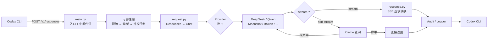

# codex-cli-proxy

Codex CLI/Desktop → 多 LLM 供应商 协议转换代理。将 OpenAI Responses API 请求转换为各供应商的 Chat Completions API 格式，并反向转换响应。监听 8317 端口。

## 架构

### 请求处理流程



### 模块分层

| 层 | 文件 | 职责 |
|----|------|------|
| **入口** | `main.py` | FastAPI 应用，lifespan 资源管理，中间件链编排 |
| **转换** | `converter/request.py` | OpenAI Responses → Chat Completions 格式转换 |
| | `converter/response.py` | Chat Completions → Responses 还原（SSE + JSON） |
| **供应商** | `providers/base.py` | 抽象基类：OpenAI 兼容端点 + Key 轮询 |
| | `providers/deepseek.py` | DeepSeek 适配器 |
| | `providers/qwen.py` | 通义千问 (DashScope) 适配器 |
| | `providers/bailian.py` | 阿里百炼适配器 |
| | `providers/moonshot.py` | Moonshot (Kimi) 适配器 |
| | `providers/siliconflow.py` | 硅基流动适配器 |
| **可靠性** | `circuit.py` | 熔断器：连续失败 N 次 → 冷却 → 半开探测 |
| | `ratelimit.py` | 令牌桶限流：按客户端 IP 控制 QPS |
| | `cache.py` | LRU + TTL 响应缓存，`X-No-Cache` 头可绕过 |
| **可观测** | `logger.py` | 双向日志：请求摘要 + 上游响应 + 下游还原 |
| | `audit.py` | JSONL 日切审计日志，记录每次请求元数据 |
| | `tracer.py` | `trace_id` 全链路追踪中间件 |
| **状态** | `store.py` | `reasoning_content` 按 session 持久化与恢复 |
| | `config.py` | YAML 配置加载：模型路由、Key 管理、思考开关 |

### 核心转换规则

| Codex (Responses API) | → | 上游 (Chat Completions) |
|-----------------------|---|-----------------------------|
| `instructions` | → | `messages[0]` (role: system) |
| `input[]` — `message` | → | 标准 `{"role":"...", "content":"..."}` |
| `input[]` — `function_call` | → | 合并到上一条 assistant 的 `tool_calls[]` |
| `input[]` — `function_call_output` | → | `{"role": "tool", "tool_call_id": "..."}` |
| `input[]` — `reasoning` | → | 跳过 |
| `input[]` — `developer` | → | 映射为 `role: system` |
| `max_output_tokens` | → | `max_tokens` |
| `tools` / `tool_choice` | → | 透传 (过滤非 function 工具) |
| `temperature` / `stream` | → | 透传 |
| — | ← | `thinking: {type: disabled}` (可配置) |

## 安装与运行

```bash
# 安装依赖
pip install -r requirements.txt

# 配置 API Key（编辑 config.yaml）
# deepseek.api_keys 下替换 sk-xxx 为真实 key

# 启动
uvicorn src.main:app --host 0.0.0.0 --port 8317

# 健康检查
curl http://localhost:8317/health

# 运行测试
pytest tests/ -v
```

## Codex CLI 接入配置

让 Codex CLI 通过 cli-proxy 代理访问上游 LLM API：

### 方式一：环境变量（推荐）

```bash
# 将 Codex CLI 的 API 地址指向本地代理
export CODEX_API_BASE_URL="http://127.0.0.1:8317/v1"

# 代理会忽略 API Key 内容（使用 config.yaml 中配置的 DeepSeek Key），
# 但仍需设置一个非空值以通过 Codex CLI 校验
export CODEX_API_KEY="sk-proxy"
```

### 方式二：Codex CLI 配置文件

编辑 `~/.codex/config.toml`（或项目级 `.codex.toml`）：

```toml
[api]
base_url = "http://127.0.0.1:8317/v1"
api_key = "sk-proxy"

[model]
# 模型名会按 config.yaml 中的 model_map 映射到 DeepSeek 模型
default = "gpt-5.5"
```

### 验证

```bash
# 1. 启动代理
uvicorn src.main:app --host 0.0.0.0 --port 8317

# 2. 验证代理健康状态
curl http://localhost:8317/health
# → {"status":"ok"}

# 3. 使用 Codex CLI，观察代理日志输出
codex "你好，请用 Python 写一个 hello world"
```

> **原理：** Codex CLI 将请求发到代理的 `/v1/responses`，代理转换为 DeepSeek Chat Completions 格式后向上游请求，再将响应转换回 Codex 兼容格式返回。

## 配置说明（config.yaml）

```yaml
server:
  host: "0.0.0.0"
  port: 8317

deepseek:
  api_base: "https://api.deepseek.com"
  api_keys:
    - "sk-xxx"                    # 替换为真实 Key
  thinking_disabled: true         # 关闭 DeepSeek 思考模式，加速响应

model_map:
  "gpt-5.5": "deepseek-v4-pro"
  "gpt-5.4": "deepseek-v4-pro"
  "deepseek-v4-pro": "deepseek-v4-pro"
```

| 配置项 | 类型 | 说明 |
|--------|------|------|
| `server.host` | string | 监听地址，默认 `0.0.0.0` |
| `server.port` | int | 监听端口，默认 `8317` |
| `deepseek.api_base` | string | DeepSeek API 地址 |
| `deepseek.api_keys` | list | API Key 列表，请求时轮询 |
| `deepseek.thinking_disabled` | bool | 关闭 DeepSeek 思考模式（默认 false） |
| `model_map` | dict | Codex 模型名 → DeepSeek 模型名映射 |

### 可靠性配置

```yaml
reliability:
  retry:
    max_retries: 3               # 上游 5xx/连接错误最大重试次数
    backoff_base: 2.0            # 指数退避基数（2^n + jitter 秒）
  circuit_breaker:
    failure_threshold: 5          # 连续失败 N 次触发熔断
    cooldown_seconds: 30.0       # 熔断冷却时间（秒）
  concurrency:
    max_concurrent: 10            # 最大并发上游请求数
    queue_timeout: 30.0           # 等待信号量的超时时间（秒）
  rate_limit:
    requests_per_minute: 30       # 单 IP 每分钟最大请求数
    burst_size: 30                # 突发容量（令牌桶容量）
```

### 多供应商支持

cli-proxy 支持接入多个 LLM 供应商，通过 `model_map` 的 `provider:model` 格式自动路由到对应平台。

#### 已支持供应商

| 供应商 | provider 名 | API 地址 | 说明 |
|--------|------------|----------|------|
| DeepSeek | `deepseek` | `https://api.deepseek.com` | 默认供应商 |
| 通义千问 (DashScope) | `qwen` | `https://dashscope.aliyuncs.com/compatible-mode` | 阿里云 DashScope |
| 百炼 | `bailian` | `https://dashscope.aliyuncs.com/compatible-mode` | 阿里云百炼平台 |
| 硅基流动 | `siliconflow` | `https://api.siliconflow.cn` | SiliconFlow 平台 |
| Moonshot (Kimi) | `moonshot` | `https://api.moonshot.cn` | 月之暗面 |

#### 配置示例

```yaml
# 1. 在 providers 段配置各供应商的 API Key
providers:
  bailian:
    api_base: "https://dashscope.aliyuncs.com/compatible-mode"
    api_keys:
      - "sk-你的百炼Key"
  siliconflow:
    api_base: "https://api.siliconflow.cn"
    api_keys:
      - "sk-你的硅基流动Key"
  qwen:
    api_base: "https://dashscope.aliyuncs.com/compatible-mode"
    api_keys:
      - "sk-你的通义千问Key"
  moonshot:
    api_base: "https://api.moonshot.cn"
    api_keys:
      - "sk-你的MoonshotKey"

# 2. 在 model_map 中配置路由规则
model_map:
  # 默认模型走 DeepSeek
  "gpt-5.5": "deepseek:deepseek-v4-pro"

  # Qwen 系列走百炼平台
  "qwen3-max": "bailian:qwen-max"
  "qwen3-plus": "bailian:qwen-plus"

  # DeepSeek 模型走硅基流动（热门模型镜像）
  "deepseek-v3": "siliconflow:deepseek-ai/DeepSeek-V3"
  "deepseek-r1": "siliconflow:deepseek-ai/DeepSeek-R1"

  # Kimi 走 Moonshot
  "kimi-latest": "moonshot:moonshot-v1-auto"
```

> **路由规则：** `model_map` 值不包含 `:` 时默认使用 DeepSeek 供应商。包含 `:` 时按 `provider:vendor_model` 解析，自动选用对应供应商的 API Key 和 Base URL。

## 请求转换补充说明

### reasoning_content 处理

- 每条成功的 DeepSeek 响应提取 `reasoning_content`，按 `session_id` 存入 `reasoning_store`
- 后续请求中的 assistant 消息自动附加对应的 `reasoning_content`
- store 持久化到 `reasoning_stores.json`，proxy 重启后自动恢复
- 检测到新对话（assistant 轮次为 0 但 store 非空）时自动重置

### 工具过滤

非 function 类型工具（如 `web_search`、`code_interpreter`）不被上游 LLM 支持，proxy 自动过滤，仅保留 function 类型。

## 响应转换规则

### 流式 (SSE)

状态机流程：`init → text → (optional) tool_calls → completed`

| SSE Event | 说明 |
|-----------|------|
| `response.created` | 创建响应 |
| `response.in_progress` | 开始处理 |
| `response.output_item.added` | 新增输出项（message 或 function_call） |
| `response.content_part.added` | 新增内容片段 |
| `response.output_text.delta` | 文本增量 |
| `response.function_call_arguments.delta` | 工具调用参数增量 |
| `response.content_part.done` | 内容片段完成 |
| `response.output_item.done` | 输出项完成 |
| `response.completed` | 响应完成 |

### 非流式

直接返回完整的 Codex Responses API 格式 JSON，包含 `id`、`object`、`status`、`output`、`usage`。

## 技术细节

| 项目 | 说明 |
|------|------|
| HTTP 客户端 | httpx AsyncClient，连接 10s / 读取 120s / 写入 60s 超时 |
| 流式 SSE 格式 | `event: <type>\ndata: <json>\n\n` |
| ID 生成 | `uuid.uuid4().hex[:12]` 带前缀（`resp_`、`item_msg_`、`call_`） |
| API Key 轮询 | 每次请求取下一个 key，循环使用 |
| reasoning 持久化 | 按 session_id 索引，JSON 文件存储，追加后即时写盘 |

## 日志示例

```
Request: model=deepseek-v4-pro, messages=7, stream=True
  [user] 帮我用node.js+HTML实现用户注册...
  [tool_call] shell({"command":"ls"})
  [tool_result] {"files":["test.py"]}
DeepSeek -> tool_call: write_file({"path":"C:\\...","content":"..."})
DeepSeek -> usage: prompt=15814 completion=380 total=16194 reasoning=0
Codex <- message: 好的，我先创建项目文件...
Response: model=deepseek-v4-pro, elapsed=3241ms, status=completed
```
